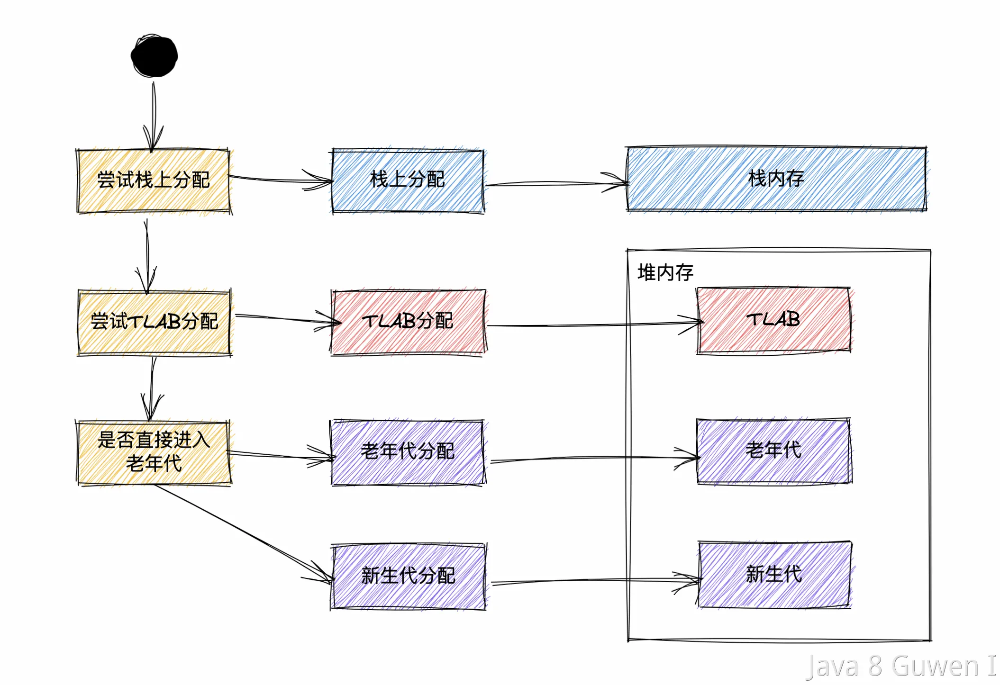

首先，我们先来梳理下，**JVM是如何给对象分配内存的：** 

1、如果JIT的逃逸分析后该对象没有逃逸，那么可能优化到栈上分配。

2、否则对象主要分配到新生代上，如果启动了TLAB，则分配到TLAB中。 

3、如果被判断为大对象，则直接分配到直接进入老年代，譬如很长的字符串和数组，避免为大对象分配内存时由于分配担保机制带来的复制而降低效率 。可以设置-XX:PretenureSizeThreshold，令大于该尺寸的对象直接进入老年代 简而言之，如下图所示：

 

 