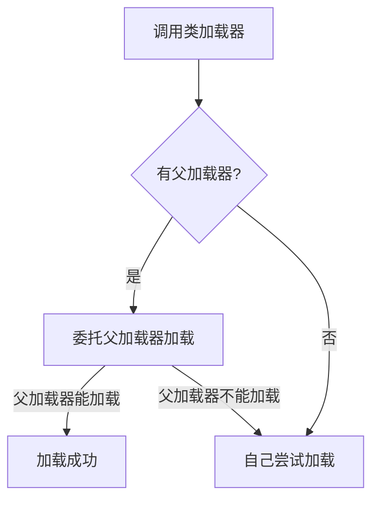

# 🚀 Java 基础高频面试题：什么是类加载器？如何实现自定义类加载器？

---

> **类加载器（ClassLoader）是 JVM 用于将 class 字节码加载到内存的组件。其核心机制为“<span style='color:#1890ff;font-weight:bold;'>双亲委派</span>”，可实现类的隔离与动态加载。**

---

## 🌟 1. 类加载器的主要类型

| 类加载器                | 作用范围                  | 说明                             |
| ----------------------- | ------------------------- | -------------------------------- |
| Bootstrap ClassLoader   | 加载 JDK 核心类（rt.jar） | JVM 自带，C++编写，无法直接访问  |
| Extension ClassLoader   | 加载扩展库（ext/*.jar）   | sun.misc.Launcher$ExtClassLoader |
| Application ClassLoader | 加载应用 classpath 下类   | sun.misc.Launcher$AppClassLoader |

---

## 🌈 2. 双亲委派模型原理

1. **加载请求先委托给父类加载器。**
2. **只有父类加载器无法完成加载时，子加载器才会尝试加载。**



> 💡 **优点：**避免类的重复加载，确保核心类不会被篡改，提升安全性。

---

## 🎯 3. 什么时候需要自定义类加载器？如何实现？

- **需求场景**：
  - 热部署/插件化（如 Tomcat、Spring Boot Devtools）
  - 加载加密/压缩的 class 文件
  - 动态生成字节码

- **实现步骤**：

```java
public class MyClassLoader extends ClassLoader {
    @Override
    protected Class<?> findClass(String name) throws ClassNotFoundException {
        // 读取字节码 -> 解密/解压 -> defineClass
    }
}
```

---

## 📝 4. 通俗示例

> 把类加载器比作“快递分拣员”，包裹（类）先交给上层分拣员（父加载器），只有上层找不到时，才由自己处理。这样可避免同一个包裹被分发两次，也能保证重要包裹不会被篡改。

---

## 🏆 5. 总结性复习提示

- **类加载器类型、双亲委派流程、定制场景和实现方式**要熟记。
- 记得举例：Tomcat 热部署、SPI 插件机制、加密 class 加载等。
- 刷题口诀：
  - 类加载三类清
  - 双亲委派防篡改
  - 自定义 loader 灵活用

---

> 🔖 **面试必记：类加载流程、双亲委派、定制 loader 应用场景与基本实现！**