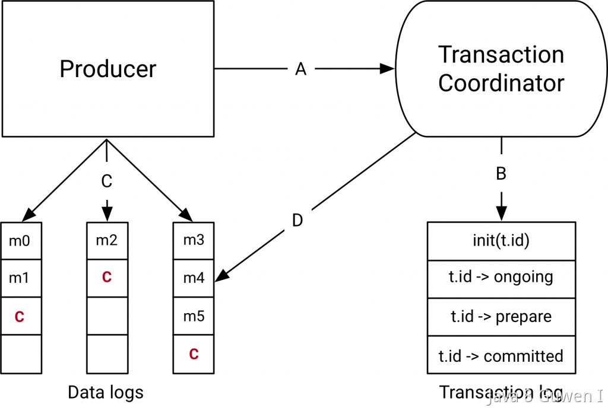
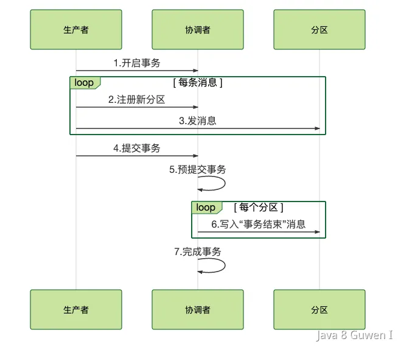

在Kafka中，事务消息可以确保一组生产或消费操作要么全部成功，要么全部失败，以保证消息处理的原子性。也就是说，他的作用是保证一组消息要么都成功，要么都失败。  没错，这就是**事务中原子性**的定义。  

只不过，通常在分布式系统中，我们通常说的事务消息，如RocketMQ的事务消息保证的时候本地事务和发MQ能作为一个原子性，即要么一起成功，要么一起失败。 

所以，**Kafka的事务消息只保证他自己的消息发送的原子性。而RocketMQ的事务消息是保证本地事务和发消息的原子性。** 

Kafka的事务机制允许一个生产者向多个主题和分区发送消息，并确保这些消息要么全部成功提交，要么全部回滚。事务由生产者负责开启、提交和回滚。Kafka通过引入**事务日志**和**协调器**来实现事务消息的管理。    Kafka为了实现事务，有几个关键组件：  

- **Transaction Coordinator（事务协调器）** 事务协调器是Kafka的一个特殊组件，负责管理生产者的事务状态。它会分配一个唯一的Transaction ID给每个生产者，并维护一个Transaction Log来记录事务的开始、提交或中止等状态信息。  
- **Producer ID (PID) 和 Epoch Kafka**为每个生产者（Producer）分配一个唯一的PID（Producer ID）和Epoch（版本号）。PID用于标识生产者，Epoch用于标识该生产者的事务版本。通过这两个字段，可以防止因重启等导致的重复消息和过期消息。  
- **Transaction Log（事务日志）** 事务日志是Kafka的一个特殊内部主题，用于记录事务的开始、提交、回滚等操作。事务协调器通过该日志确保事务的原子性和一致性。 

他的实现过程大致如下：  

1、**开启事务**  生产者在初始化时需要配置`transactional.id`来启用事务，在每次事务开始时，生产者会给协调者发请求来开启事务，协调者在事务日志中记录下事务 ID。  

2、**发送消息** 生产者发消息之前，先发送请求事务协调器，让他记录消息发送的主题和分区。接下来开始向Broker发消息，  

3、**提交事务** 当所有消息发送完毕，生产者调用`commitTransaction()`来提交事务。此时，事务协调器会将所有消息的状态改为已提交，并通知消费者可以读取这些消息。 

4、**回滚事务** 如果在事务过程中出现异常，生产者可以调用abortTransaction()回滚事务。事务协调器会将所有相关消息标记为中止状态，确保消费者无法读取未完成的消息。   

这里的事务提交和回滚，其实也是遵循了一个2阶段提交的。协调者在接收到提交或者回滚请求时，

第一阶段，他会把事务的状态设置为“预提交”，并写入事务日志。

接下来第二阶段，协调者在事务相关的所有分区中，都会写一条“事务结束”的特殊消息，当 Kafka 的消费者，也就是客户端，读到这个事务结束的特殊消息之后，它就可以把之前暂时过滤的那些未提交的事务消息，放行给业务代码进行消费了。最后，协调者记录最后一条事务日志，标识这个事务已经结束了。    

 