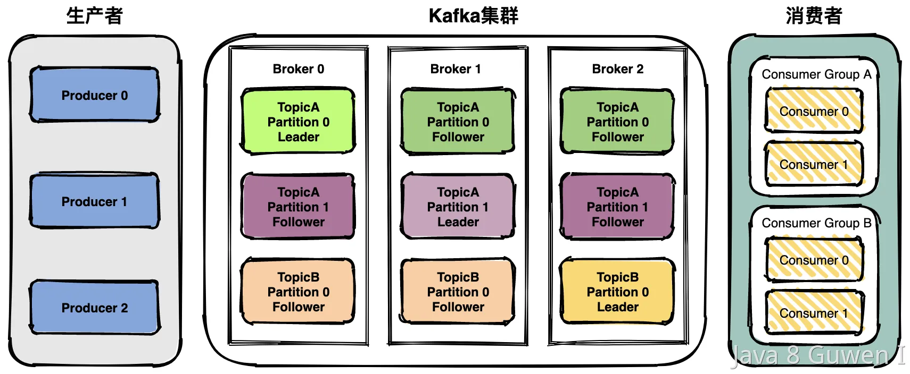
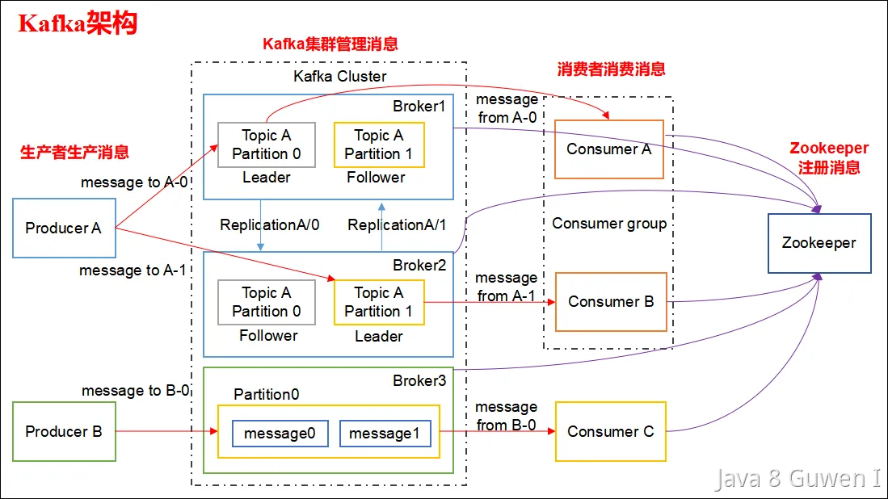

 

**生产者（Producer）**：生产者负责将消息发布到Kafka集群中的一个或多个主题(Topic)，每个Topic包含一个或多个分区（Partition）。

> 主题：Topic。主题是承载消息的逻辑容器，在实际使用中多用来区分具体的业务。 分区：Partition。一个有序不变的消息序列。每个主题下可以有多个分区。  

**消费者（Consumer）**：消费者负责从Kafka集群中的一个或多个主题消费消息，并将消费的偏移量（Offset）提交回Kafka以保证消息的顺序性和一致性。 

> 偏移量：Offset。表示分区中每条消息的位置信息，是一个单调递增且不变的值。 

**Kafka集群**：Kafka集群是由多个Kafka节点（Broker）组成的分布式系统。每个节点都可以存储一个或多个主题（topic）的分区（partition）副本，以提供高可用性和容错能力。 

 

**在集群中，每个分区（partition）都可以有多个副本。这些副本中包含了一个 Leader （也可以叫做Leader Partition 或者 Leader Replication） 和多个 Follower （也可以叫做Follower Partition 或者 Follower Replication），只有 Leader 才能处理生产者和消费者的请求，而 Follower  只是 Leader  的备份，用于提供数据的冗余备份和容错能力。如果 Leader  发生故障，Kafka 集群会自动将 Follower  提升为新的 Leader ，从而实现高可用性和容错能力。** 

 **ZooKeeper**：ZooKeeper是Kafka集群中使用的分布式协调服务，用于维护Kafka集群的状态和元数据信息，例如主题和分区的分配信息、消费者组和消费者偏移量等。 