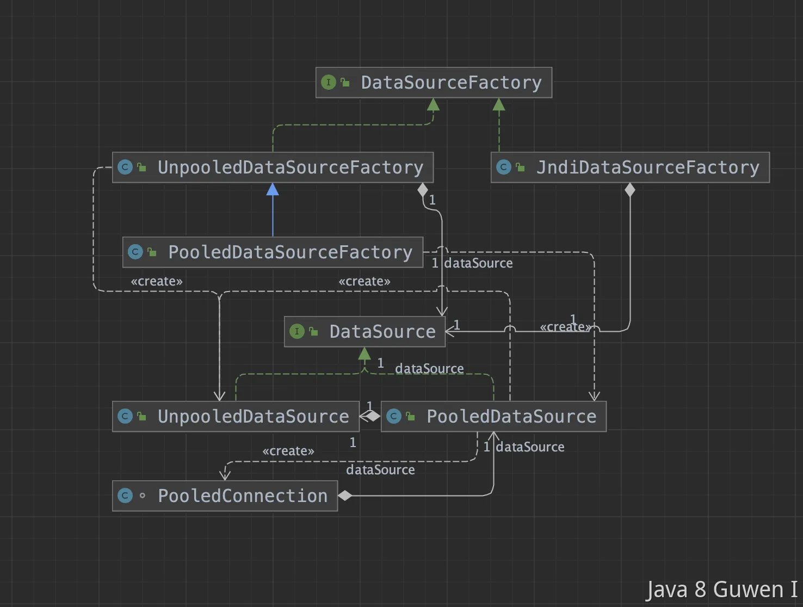

Mybatis内置了三种数据源，分别是Pooled，Unpooled和JNDI，其中Pooled数据源是具有连接池的。同时Mybatis也可以使用三方数据源，如Druid，Hikari，C3P0等等 Mybatis数据源的类图如下所示： 

 

可以看到，在Mybatis中，会通过工厂模式来获得对应的数据源，那么Mybatis是在执行的哪一步获取的呢？ 答案是在执行SQL之前，Mybatis会获取数据库连接Connection，而此时获得的Connection则是应用的启动的时候，已经通过配置项中的文件加载到内存中了： 

```xml

<dataSource type="org.apache.ibatis.datasource.pooled.PooledDataSource">
  <property name="driver" value="com.mysql.jdbc.Driver"/>
  <property name="url" value="jdbc:mysql://localhost:3306/mybatis"/>
  <property name="username" value="root"/>
  <property name="password" value="123456"/>
</dataSource>
```


一般情况下，我们不会使用Mybatis默认的PooledDataSource，而是会用Hikari，如果要增加Sql监控功能的话，也可以使用Druid，这是因为自带的数据库连接池有三个缺点： 

1、空闲连接占用资源：连接池维护一定数量的空闲连接，这些连接会占用系统的资源，如果连接池设置过大，那么会浪费系统资源，如果设置过小，则会导致系统并发请求时连接不够用，影响系统性能。 

2、连接池大小调优困难：连接池的大小设置需要根据系统的并发请求量、数据库的性能和系统的硬件配置等因素综合考虑，而这些因素都是难以预测和调整的。 

3、连接泄漏：如果应用程序没有正确关闭连接，那么连接池中的连接就会泄漏，导致连接池中的连接数量不断增加，最终导致系统崩溃。 

总的来说，专业的事情交给专业的组件来做，Mybatis功能的核心是ORM映射和缓存，数据库连接池这种东西，市场上已经有比它做的更好的，我们直接用那些更好的就行了。 