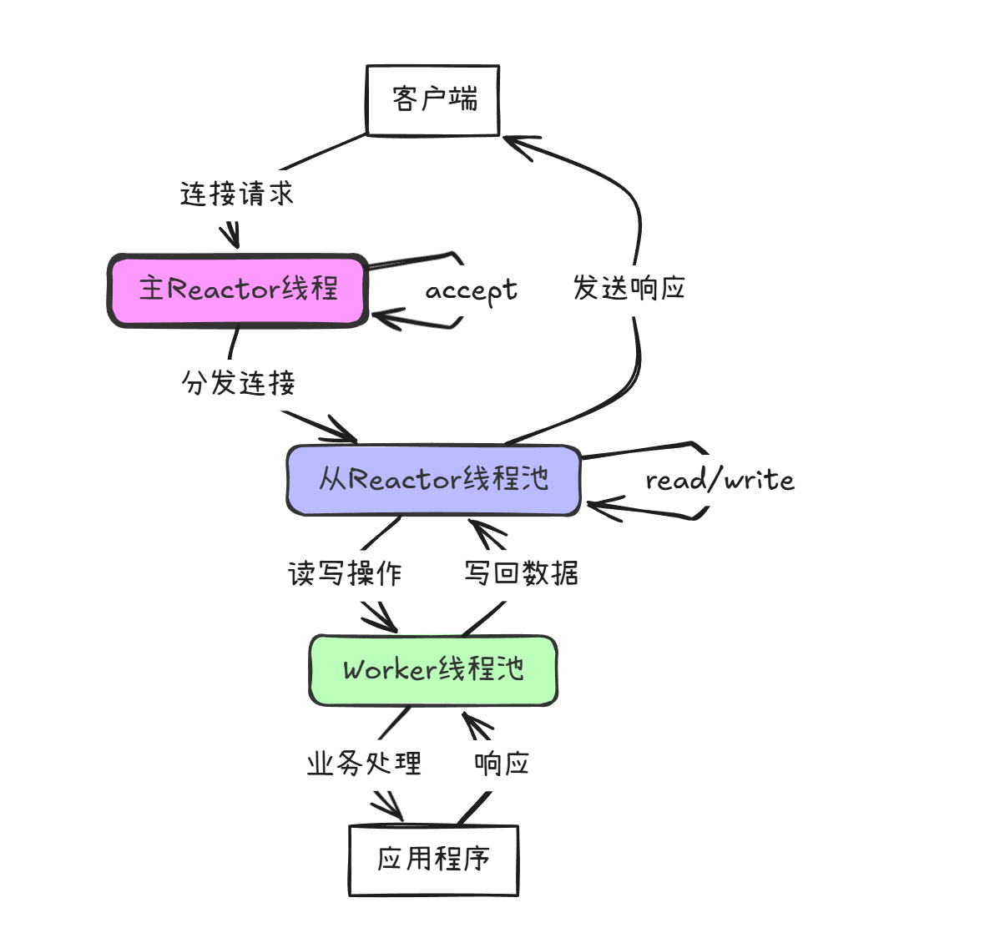
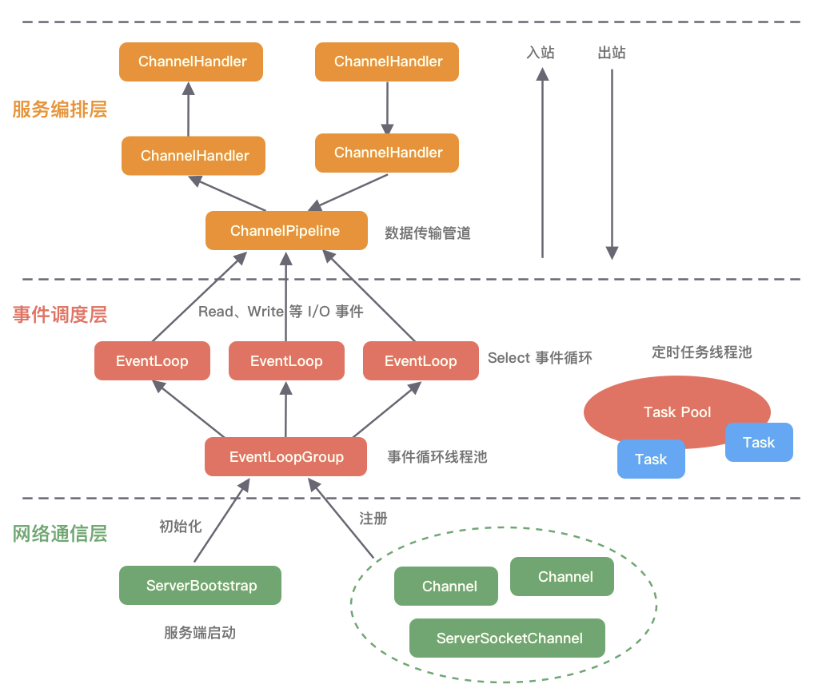

# Netty 常用 API、核心类与方法总结





---

##  1. 常用 API 总览

| API/类名                    | 说明                                |
| --------------------------- | ----------------------------------- |
| EventLoopGroup              | 事件循环线程组，管理EventLoop       |
| NioEventLoopGroup           | 基于NIO的EventLoopGroup实现         |
| Channel                     | 网络连接抽象，所有数据操作的载体    |
| NioSocketChannel            | 客户端TCP通道实现                   |
| NioServerSocketChannel      | 服务端TCP通道实现                   |
| Bootstrap                   | 客户端启动辅助类                    |
| ServerBootstrap             | 服务端启动辅助类                    |
| ChannelHandler              | 业务处理器接口                      |
| ChannelInboundHandler       | 入站事件处理接口                    |
| ChannelOutboundHandler      | 出站事件处理接口                    |
| ChannelHandlerAdapter       | Handler适配器，便于只重写需要的方法 |
| ChannelPipeline             | Handler链（管道），事件传播通道     |
| ChannelFuture               | 异步操作结果对象                    |
| ChannelInitializer          | Channel初始化工具类                 |
| ChannelOption               | 通道参数设置                        |
| ByteBuf                     | Netty数据缓冲区                     |
| SimpleChannelInboundHandler | 简化的入站数据处理器                |
| AttributeKey                | 自定义属性绑定到Channel             |
| IdleStateHandler            | 空闲状态检测                        |

---

## 2. 关键类与接口

### EventLoopGroup
- 用于管理I/O线程，负责事件轮询、任务调度等。
- 常用：`NioEventLoopGroup`

### Channel
- 所有网络I/O操作的载体。
- 主要实现：`NioSocketChannel`、`NioServerSocketChannel`、`NioDatagramChannel`

### Bootstrap / ServerBootstrap
- 启动客户端/服务端的主要入口。
- `Bootstrap` 用于客户端，`ServerBootstrap` 用于服务端。

### ChannelHandler & 其 Adapter
- 用于处理I/O事件和数据。
- `ChannelInboundHandlerAdapter`、`ChannelOutboundHandlerAdapter`、`SimpleChannelInboundHandler`

### ChannelPipeline
- 事件处理链，包含多个ChannelHandler。

### ByteBuf
- Netty的数据缓冲区，比Java NIO的ByteBuffer更高效灵活。

---

## 3. 常用方法

### EventLoopGroup
- `shutdownGracefully()`：优雅关闭线程组

### Bootstrap/ServerBootstrap
- `group()`：设置EventLoopGroup

- `channel()`：设置通道类型

- `handler()` / `childHandler()`：设置初始化器

- `option()` / `childOption()`：设置通道参数

  - > Netty 的 `option` 参数用于设置 Channel 的底层属性（底层 socket 选项），常用于 `ServerBootstrap` 或 `Bootstrap` 的配置阶段。不同类型的 Channel 支持的 `option` 可能不同，主要分为服务端（`NioServerSocketChannel`）和客户端（`NioSocketChannel`）。
    >
    > 下面列举常用的 Netty `option` 参数及其含义：
    >
    > ---
    >
    > ## 1. 常用的 ServerBootstrap `option`
    >
    > 这些一般用于 `ServerBootstrap.option()`（用于服务端 ServerSocketChannel）：
    >
    > | 选项名                     | 说明                                                         |
    > | -------------------------- | ------------------------------------------------------------ |
    > | ChannelOption.SO_BACKLOG   | 服务端可连接队列长度（backlog），全称是 socket backlog。默认 128。 |
    > | ChannelOption.SO_REUSEADDR | 是否允许地址重用。默认 true。                                |
    >
    > **示例：**
    > ```java
    > serverBootstrap.option(ChannelOption.SO_BACKLOG, 1024);
    > serverBootstrap.option(ChannelOption.SO_REUSEADDR, true);
    > ```
    >
    > ---
    >
    > ## 2. 常用的 childOption（作用于每个新建立的 SocketChannel）
    >
    > 这些一般用于 `ServerBootstrap.childOption()` 或 `Bootstrap.option()`，针对每个客户端连接：
    >
    > | 选项名                               | 说明                                                       |
    > | ------------------------------------ | ---------------------------------------------------------- |
    > | ChannelOption.SO_KEEPALIVE           | 是否开启 TCP keepalive，检测死连接。默认 false。           |
    > | ChannelOption.TCP_NODELAY            | 是否禁用 Nagle 算法，低延迟通信建议设为 true。默认 false。 |
    > | ChannelOption.SO_RCVBUF              | TCP 接收缓冲区大小（字节）。                               |
    > | ChannelOption.SO_SNDBUF              | TCP 发送缓冲区大小（字节）。                               |
    > | ChannelOption.SO_LINGER              | 设置关闭时的延迟时间（秒），0 立即关闭。                   |
    > | ChannelOption.SO_REUSEADDR           | 地址重用。                                                 |
    > | ChannelOption.IP_TOS                 | IP 层的服务类型。                                          |
    > | ChannelOption.ALLOW_HALF_CLOSURE     | 是否允许半关闭连接。                                       |
    > | ChannelOption.CONNECT_TIMEOUT_MILLIS | 连接超时时间（毫秒）。                                     |
    > | ChannelOption.AUTO_READ              | 是否自动读取数据。                                         |
    >
    > **示例：**
    > ```java
    > serverBootstrap.childOption(ChannelOption.SO_KEEPALIVE, true);
    > serverBootstrap.childOption(ChannelOption.TCP_NODELAY, true);
    > serverBootstrap.childOption(ChannelOption.SO_RCVBUF, 1024 * 64);
    > serverBootstrap.childOption(ChannelOption.SO_SNDBUF, 1024 * 64);
    > ```
    >
    > ---
    >
    > ## 3. 其它常用 Option（通用）
    >
    > | 选项名                                     | 说明                         |
    > | ------------------------------------------ | ---------------------------- |
    > | ChannelOption.WRITE_BUFFER_HIGH_WATER_MARK | 写缓冲区高水位线。用于流控。 |
    > | ChannelOption.WRITE_BUFFER_LOW_WATER_MARK  | 写缓冲区低水位线。用于流控。 |
    > | ChannelOption.MESSAGE_SIZE_ESTIMATOR       | 消息大小估算器。             |
    > | ChannelOption.MAX_MESSAGES_PER_READ        | 每次读操作读取的最大消息数。 |
    >
    > ---
    >
    > ## 4. 示例代码
    >
    > ```java
    > ServerBootstrap b = new ServerBootstrap();
    > b.group(bossGroup, workerGroup)
    >  .channel(NioServerSocketChannel.class)
    >  .option(ChannelOption.SO_BACKLOG, 128)
    >  .option(ChannelOption.SO_REUSEADDR, true)
    >  .childOption(ChannelOption.SO_KEEPALIVE, true)
    >  .childOption(ChannelOption.TCP_NODELAY, true)
    >  .childOption(ChannelOption.SO_RCVBUF, 32 * 1024)
    >  .childOption(ChannelOption.SO_SNDBUF, 32 * 1024);
    > ```
    >
    > ---
    >
    > ## 5. ChannelOption 常量类说明
    >
    > 所有可用的参数都定义在 `io.netty.channel.ChannelOption` 类中，可以查看 [ChannelOption 源码](https://netty.io/4.1/api/io/netty/channel/ChannelOption.html) 或直接在 IDE 输入 `ChannelOption.` 查看自动补全。
    >
    > ---
    >
    > ## 6. 总结
    >
    > 常用的 Netty option 有：
    >
    > - SO_BACKLOG
    > - SO_REUSEADDR
    > - SO_KEEPALIVE
    > - TCP_NODELAY
    > - SO_RCVBUF / SO_SNDBUF
    > - SO_LINGER
    > - CONNECT_TIMEOUT_MILLIS
    > - AUTO_READ
    > - WRITE_BUFFER_HIGH_WATER_MARK/LOW_WATER_MARK
    > - ALLOW_HALF_CLOSURE
    >
    > 根据实际业务需求灵活组合设置即可。
    >
    > 如果需要完整列表或某个参数详细说明，可以继续追问！

- `bind()`：绑定端口启动服务（服务端）

- `connect()`：连接服务器（客户端）

### ChannelPipeline

- `addLast(ChannelHandler...)`：添加Handler到管道末尾
- `remove(ChannelHandler)`：移除Handler

### ByteBuf
- `writeBytes(byte[])`：写数据
- `readBytes(byte[])`：读数据
- `release()`：回收缓冲区

### Channel
- `writeAndFlush(Object msg)`：写并发送消息
- `close()`：关闭通道

### ChannelFuture
- `addListener(GenericFutureListener)`：添加异步操作监听器
- `sync()`：阻塞直到操作完成

### ChannelHandlerContext
- `fireChannelRead(Object msg)`：向下传播消息
- `writeAndFlush(Object msg)`：发送消息

### IdleStateHandler
- 构造方法设置读/写/总空闲时间
- 触发userEventTriggered

---

## 4. 典型代码片段

### 服务端启动
```java
ServerBootstrap b = new ServerBootstrap();
b.group(bossGroup, workerGroup)
 .channel(NioServerSocketChannel.class)
 .childHandler(new ChannelInitializer<SocketChannel>() {
     @Override
     public void initChannel(SocketChannel ch) {
         ch.pipeline().addLast(new MyServerHandler());
     }
 });
b.bind(8080).sync();
```

### 客户端启动
```java
Bootstrap b = new Bootstrap();
b.group(group)
 .channel(NioSocketChannel.class)
 .handler(new ChannelInitializer<SocketChannel>() {
     @Override
     public void initChannel(SocketChannel ch) {
         ch.pipeline().addLast(new MyClientHandler());
     }
 });
b.connect("localhost", 8080).sync();
```

### Handler 示例
```java
public class MyHandler extends ChannelInboundHandlerAdapter {
    @Override
    public void channelRead(ChannelHandlerContext ctx, Object msg) {
        // 处理收到的数据
        ctx.writeAndFlush("response");
    }
}
```

---

## 5. 编解码相关

- `StringEncoder` / `StringDecoder`
- `LengthFieldBasedFrameDecoder`
- `DelimiterBasedFrameDecoder`
- 自定义：继承 `MessageToByteEncoder`、`ByteToMessageDecoder`

---

# Netty 线程模型方案说明

## 1. 线程池分组

- **BossGroup**：专门负责接收客户端连接请求。
- **WorkerGroup**：专门负责处理网络的读写操作。

## 2. NioEventLoop 介绍

- **NioEventLoop**：表示一个不断循环执行处理任务的线程。
  - 每个 NioEventLoop 都有一个 **Selector**，用于监听绑定在其上的 socket 网络通道。
  - 内部采用串行化设计：从消息的读取 → 解码 → 处理 → 编码 → 发送，始终由 IO 线程 NioEventLoop 负责。
- **NioEventLoopGroup**：下包含多个 NioEventLoop。

## 3. NioEventLoop 细节

- 每个 NioEventLoop 包含：
  - 一个 **Selector**
  - 一个 **taskQueue**
- 每个 NioEventLoop 的 Selector 上可以注册监听多个 NioChannel。
- 每个 NioChannel 只会绑定在唯一的 NioEventLoop 上。
- 每个 NioChannel 都绑定有一个自己的 **ChannelPipeline**。

## 4. 结构关系图示（文本版）

```
NioEventLoopGroup
    ├── NioEventLoop1
    │     ├── Selector1
    │     ├── taskQueue1
    │     └── NioChannelA (有自己的 ChannelPipeline)
    ├── NioEventLoop2
    │     ├── Selector2
    │     ├── taskQueue2
    │     └── NioChannelB (有自己的 ChannelPipeline)
    └── ...
```

---

## 5. 总结要点

- BossGroup 负责连接接收，WorkerGroup 负责读写处理。
- NioEventLoop 是一个事件循环线程，管理 Selector 和任务队列。
- 每个 NioEventLoop 可以管理多个 NioChannel，但每个 NioChannel 只属于一个 NioEventLoop。
- 每个 NioChannel 绑定有独立的 ChannelPipeline，负责处理其所有 I/O 事件和数据流转。