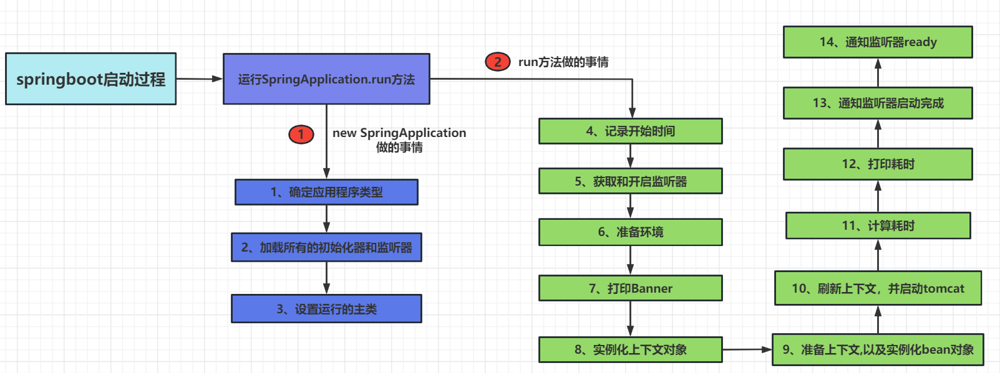

1、确定应用程序类型为web应用还是普通应用； 通过类路径中是否存在servlet相关的类就是web应用。

2、设置初始化器这一步触发了springboot自动配置的动作，就是从spring.factories加载并实例化指定的类。

6、准备环境：加载配置文件，准备系统变量、命令行参数，最终封装成ConfigurableEnvironment。

10、如果是web项目，就会启动tomcat。调用CommandLineRunner和ApplicationRunner。

