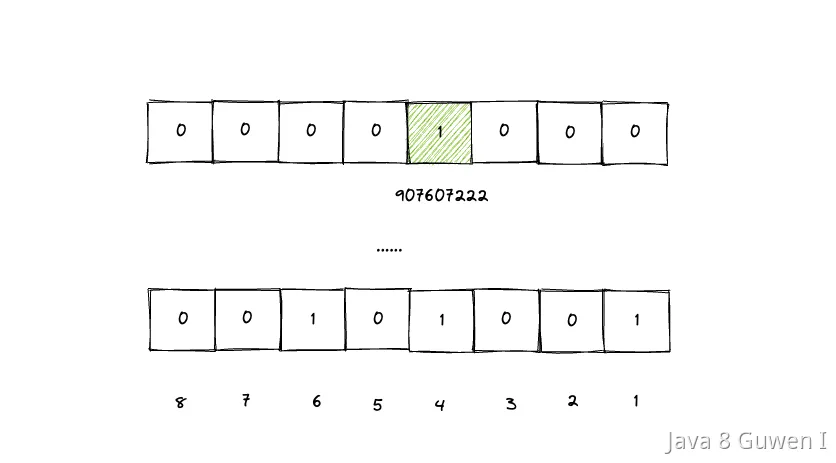

10位数字的QQ号，想要去重，又不给那么多的空间，该如何实现呢？  

40亿个unsigned int，如果直接用内存存储的话，需要：  

4*4000000000 /1024/1024/1024 = 14.9G ，考虑到其中有一些重复的话，那1G的空间也基本上是不够用的。  

想要实现这个功能，可以借助**位图**。 

使用位图的话，一个数字只需要占用1个bit，那么40亿个数字也就是：  

4000000000 * 1 /8 /1024/1024 = 476M   

相比于之前的14.9G来说，大大的节省了很多空间。  

但是其实，如果有 bitmap 存数字的话，就不是存4000000000个了，因为数字最大有10位数，其实是需要9999999999（10个9）个bit 用来存储，那其实是：  

10000000000*1/8/1024/1024=1192M，那也是比14.9G 要小很多的。  

比如要把我的QQ号"907607222"放到Bitmap中，就需要找到第907607222这个位置，然后把他设置成1就可以了。 

 

这样，把40亿个数字都放到Bitmap之后，所有位置上是1的表示存在，不为1的表示不存在，相同的QQ号只需要设置一次1就可以了，那么，最终就把所有是1的数字遍历出来就行了。 