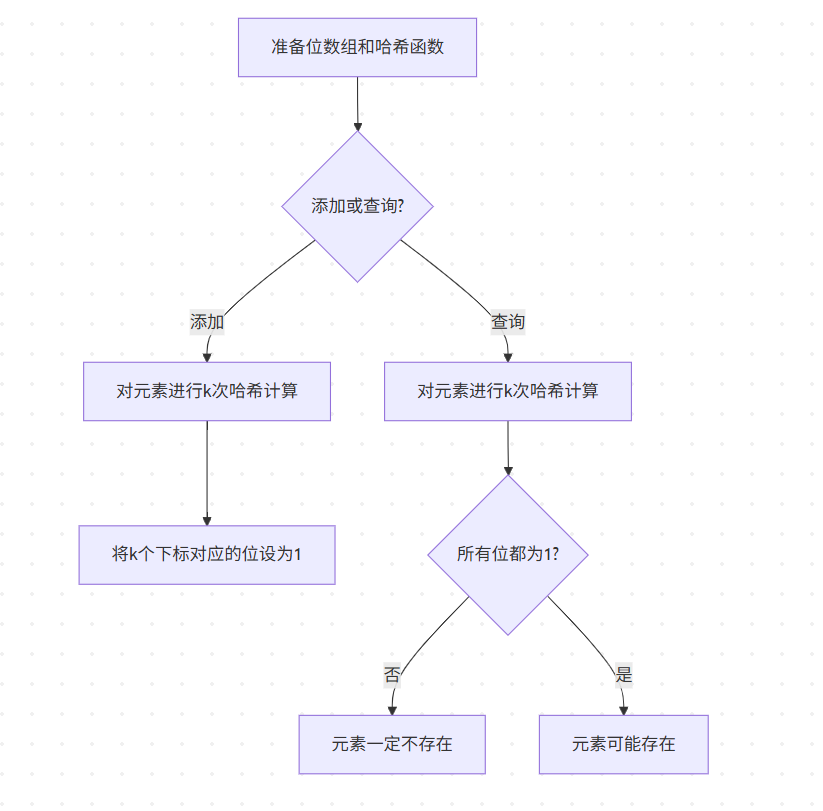

🌟 **什么是布隆过滤器？**

布隆过滤器（Bloom Filter）是一种**概率型数据结构**，用来判断某个元素是否在一个集合中。它的特点是**高效的存储和查询**，但会有一定的误判率（假阳性）。  
- **优点**：节省内存，查询速度快。  
- **缺点**：可能存在误判，无法删除元素。

---

🎯 **实现原理**

1️⃣ **位数组初始化**  
首先，准备一个长度为 `m` 的位数组（全初始化为 0）。  

```
   [0][0][0][0][0][0][0][0][0][0] ... (m位)
```

2️⃣ **添加元素**  
当向布隆过滤器添加一个元素时，利用 `k` 个独立的哈希函数对元素进行哈希计算，得到 `k` 个下标。然后将位数组中这些对应位置置为 `1`。

   - 例如，哈希函数对元素 `A` 计算出下标为 2 和 5，则位数组变为：
     ```
     [0][0][1][0][0][1][0][0][0][0] ...
          ↑     ↑
     ```

3️⃣ **查询元素**  
查询某个元素是否存在时，同样使用 `k` 个哈希函数计算其下标，检查这些位置是否都为 `1`：
   - 如果**有任意一个位为 0**，则该元素一定不存在。
   - 如果**所有位都为 1**，则该元素可能存在（但可能为误判）。

---

⚡ **布隆过滤器的工作流程**



---

🌈 **布隆过滤器的优缺点**

| 优点 🚀             | 缺点 ⚠️                             |
| ------------------ | ---------------------------------- |
| 高效使用内存       | 存在误判（假阳性）                 |
| 查询速度快         | 无法删除元素                       |
| 适合大规模数据判重 | 需要设计合理的哈希函数和位数组大小 |

---

✨ **应用场景**

- **黑名单检测**：快速判断 IP 或用户是否在黑名单中。
- **缓存穿透防护**：在分布式缓存系统中避免查询无效数据。
- **爬虫 URL 去重**：高效存储已访问的 URL。
- **数据库判重**：判断数据是否已存在于数据库中。

🌟 布隆过滤器是处理大数据场景下的重要工具，其高效性和灵活性使它成为分布式系统中不可或缺的组件！