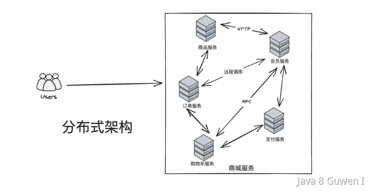

# 分布式架构一定比单体架构好吗？🤔

答案：**不一定！** 架构没有绝对的好坏，只有是否适合当前业务和团队的选择。下面为你详细拆解两者的优缺点及适用场景：

 

---

## 单体架构 Monolithic 🏢

### 优点
1. **开发/测试/部署简单**：一个项目，开发部署都很方便，出错点少。
2. **无分布式复杂性**：不需要考虑分布式事务、分布式锁、分布式 ID 等难题。
3. **性能延迟低**：模块间本地调用，基本没有网络延迟。
4. **问题排查容易**：所有日志、业务都在一个地方，排查方便。

### 缺点
1. **单机性能瓶颈**：业务增长后，计算和存储资源受限于单机。
2. **开发效率下降**：代码量大，团队协作冲突多，维护成本高。
3. **单点故障**：任何一个模块出问题，可能影响整个系统。
4. **技术栈受限**：难以引入新技术，适应新业务需求。

---

## 分布式架构（微服务）🌐

### 优点
1. **易于扩展**：可横向扩容，轻松支持高并发和大业务量。
2. **模块解耦**：服务独立开发、部署、运维，互不影响。
3. **高可用性**：单个服务故障不会影响整体系统。
4. **技术多样性**：各服务可选最适合自身的技术栈。

### 缺点
1. **运维、部署、监控复杂**：需管理多个服务，增加 DevOps、监控、故障处理难度。
2. **分布式一致性难题**：CAP 理论、分布式事务、服务发现、负载均衡等。
3. **故障排查复杂**：需引入分布式链路追踪系统，问题定位难度提升。

---

## 适用场景 🎯

- **单体架构适合**：小型项目、团队人数少、开发周期短、业务变化不大、对扩展性要求不高。
- **分布式架构适合**：中大型项目、业务复杂、团队大、对高并发高可用有硬性需求。

---

> **总结：**
> 分布式架构不是银弹，只有在业务确实需要扩展性和高可用时才值得投入。否则，单体架构的简单和高效能带来更多价值。架构选型以业务需求和团队能力为根本出发点！✅