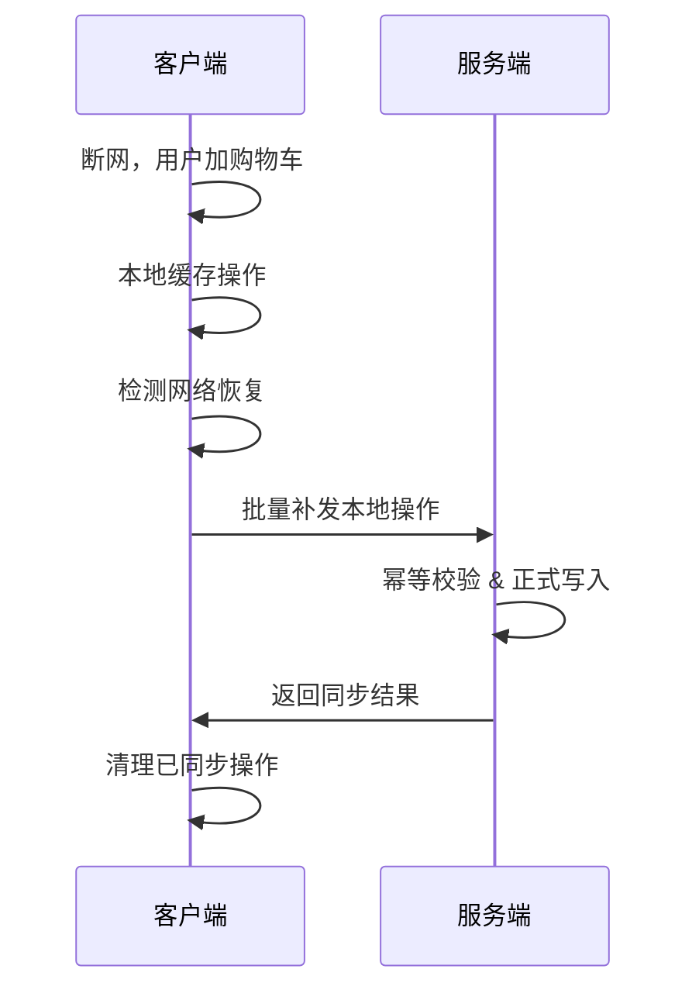

# 商品加入购物车时断网，重新联网后如何同步？【标准方案】

这个问题考察移动端/前端“离线操作同步机制”——保证用户断网时的操作不会丢失，联网后能可靠同步到后端。

---

## 1️⃣ 客户端侧

### 本地缓存
- **操作缓存**：断网时，将“加购物车”操作（商品ID、数量、操作类型、时间戳、唯一请求ID等）持久化到本地（如 SQLite、本地文件、IndexedDB 等）。
- **数据结构**：每条记录应包括操作类型、商品信息、唯一操作标识（如UUID）等。

### 网络状态检测
- 监听网络状态（如 Android 的 ConnectivityManager、iOS 的 NWPathMonitor、Web 的 navigator.onLine）。
- 网络恢复时，自动触发同步逻辑。

### 同步与重试机制
- 联网后，遍历本地缓存，逐条同步到服务端。
- 同步失败的可再次重试，采用**指数退避**（即多次失败后，重试间隔递增，避免频繁请求服务器）。

---

## 2️⃣ 服务端侧

### 幂等性
- 后端接口必须**保证幂等**，即多次收到同一操作不会重复加商品。
- 通常做法：每次请求携带唯一操作ID，服务端用ID做去重。

---

## 3️⃣ 典型流程图

---

## 4️⃣ 注意事项

- **本地缓存持久化**，避免App意外退出丢操作。
- **同步成功后要清理缓存**，避免下次重复同步。
- **同步顺序要保证**，如有依赖（先加后删）按时间戳/队列顺序发送。
- 网络不稳定时，避免并发同步，防止乱序。

---

## ✅ 总结

> 离线操作先本地缓存，联网后自动补发，服务端必须幂等防重，采用重试和网络检测机制，才能让购物车体验流畅可靠！