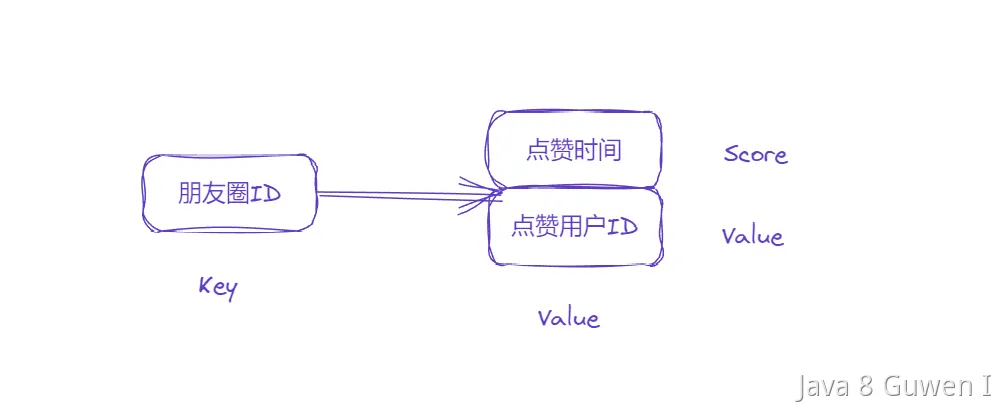

首先我们需要分析下朋友圈点赞需要有哪些功能，首先记录某个朋友圈的点赞数量，并且支持点赞数数量的查看，支持点赞和取消点赞操作。并且支持查看哪些人点过赞，并且点赞的顺序是可以看得到的。 

 

那么，基于以上信息，我们可以这样实现：  

在数据结构上，我们可以采用ZSet来实现，KEY就是这个具体的朋友圈的ID，ZSET的value表示点赞用户的ID，score表示点赞时间的时间戳。这样可以方便地按照时间顺序查询点赞信息，并支持对点赞进行去重，  

1. 使用字符串存储每篇朋友圈的ID，作为有序集合的KEY。 
2. 使用zset存储每篇朋友圈的点赞用户信息，其中value为点赞用户的ID，score为点赞时间的时间戳。 
3. 点赞操作：将用户的ID添加到zset中，score为当前时间戳。如果用户已经点过赞，则更新其点赞时间戳。 
4. 取消点赞操作：将用户的ID从有序集合中删除。 
5. 查询点赞信息：使用有序集合的ZREVRANGEBYSCORE命令，按照score（即时间戳）逆序返回zset的value，即为点赞用户的ID。 

```java
import redis.clients.jedis.Jedis;
import redis.clients.jedis.Transaction;
import redis.clients.jedis.ZParams;

public class RedisLikeDemo {
    private static final String LIKE_PREFIX = "like:";
    private static final String USER_PREFIX = "user:";

  	//点赞
    public static void likePost(String postId, String userId, Jedis jedis) {
        String key = LIKE_PREFIX + postId;
        Long now = System.currentTimeMillis();
        jedis.zadd(key, now.doubleValue(), userId);// 将用户ID及当前时间戳加入有序集合
    }

  	//取消点赞
    public static void unlikePost(String postId, String userId, Jedis jedis) {
        String key = LIKE_PREFIX + postId;
        jedis.zrem(key, userId);// 将用户ID从有序集合中移除
    }

  	//查看点赞列表
    public List<String> getLikes(String postId, Jedis jedis) { // 点赞数量就是list的大小
        String key = LIKE_PREFIX + postId;
        ZParams zParams = new ZParams().desc();
        return jedis.zrangeByScoreWithScores(key, "+inf", "-inf", 0, -1, zParams)
                .stream()
                .map(tuple -> {
                    String userId = tuple.getElement();
                    return userId;
                }).collect(Collectors.toList());
    }
}

```


在上述代码中，likePost方法用于点赞，unlikePost方法用于取消点赞，getLikes方法用于查询点赞信息。 

> 在使用 Redis 的 ZSet 来实现朋友圈点赞的场景中，**点赞数量**可以通过 Redis 的命令 `ZCARD` 或 `ZCOUNT` 来获取。
>
> ---
>
> ### **如何获取点赞数量？**
>
> 1. **使用 `ZCARD`：**
>    - `ZCARD` 命令可以直接获取 ZSet 中的成员数量，即点赞的用户总数。
>    - 示例：
>      ```redis
>      ZCARD feed:12345
>      ```
>      如果 `feed:12345` 的 ZSet 中有 5 个用户点赞，则返回：
>      ```
>      5
>      ```
>
> 2. **使用 `ZCOUNT`（按条件统计）：**
>    - `ZCOUNT` 命令可以统计 ZSet 中符合特定分数范围的成员数量。
>    - 例如，统计某条朋友圈在特定时间范围内的点赞数量：
>      ```redis
>      ZCOUNT feed:12345 1626867600 1626867900
>      ```
>      这里的 `1626867600` 和 `1626867900` 是时间戳范围，表示统计在这个时间范围内的点赞数量。
>
> ---
>
> ### **点赞数量的意义**
> - **获取总点赞数：** 使用 `ZCARD` 快速统计总点赞数量。
> - **按时间统计：** 使用 `ZCOUNT` 可以统计指定时间范围内的点赞数量，适合分析点赞趋势。
>
> ---
>
> ### **总结**
> 通过 Redis 的 ZSet 和相关命令，可以方便地统计点赞数量：
> - 总数量：`ZCARD`
> - 时间范围内点赞数量：`ZCOUNT`