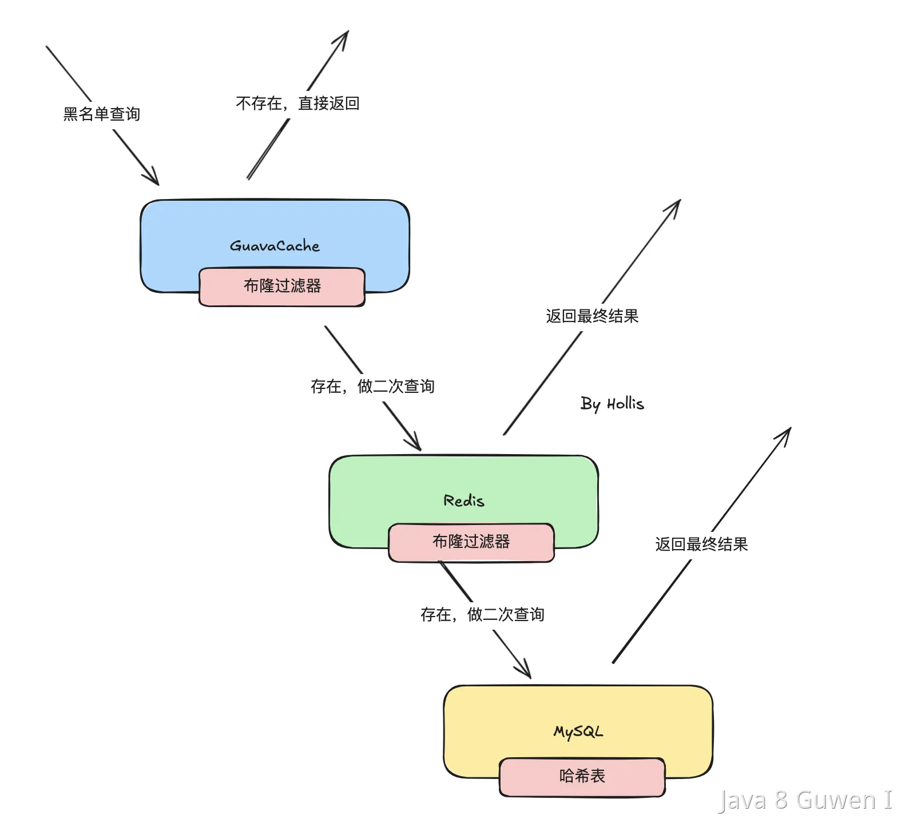

# 黑名单网址过滤系统设计与数据结构选择

## 实现思路

一个高效的黑名单网址过滤系统，核心目标是：
- **高效查询**：快速判断网址是否在黑名单中
- **节省内存**：黑名单可能很大，需考虑内存占用
- **支持前缀匹配**：如拦截 *.bad.com
- **可扩展性**：方便应对黑名单动态增长

---

## 常用数据结构分析

### 1. 哈希表（Hash Table）🔗
- **用途**：存储完整的域名或URL
- **优点**：查询速度快（O(1)）
- **缺点**：不支持前缀/模糊匹配，内存占用大
- **适用场景**：黑名单数量中等，主要是精确匹配

---

### 2. 前缀树 / 字典树（Trie）🌲
- **用途**：存储域名、URL前缀，支持前缀匹配
- **优点**：支持高效的前缀搜索，比如拦截所有 *.bad.com
- **缺点**：内存占用比哈希表还高
- **适用场景**：需要支持前缀匹配的场景

---

### 3. 布隆过滤器（Bloom Filter）🌸
- **用途**：快速判断某网址是否“可能”在黑名单中
- **优点**：极省内存，O(1)判断，适合大规模黑名单
- **缺点**：有误判（false positive），不能删除元素
- **适用场景**：大批量黑名单、允许极小概率误判、对“误封”有兜底机制

---

### 4. 组合方案（推荐✨）

实际工程中，通常会**组合上述多种数据结构**，形成多层过滤体系：

1. **第一层**：布隆过滤器  
   - 判断“不在黑名单”则直接放行
   - 判断“可能在黑名单”则进入下一层精确校验

2. **第二层**：哈希表/前缀树  
   - 精确查表或前缀树，确认网址是否真正属于黑名单

3. **三层存储架构**  
   - **本地缓存**（如 Guava Cache）或 Redis 布隆过滤器：快速初筛
   - **Redis 哈希表/字典树**：精确二次过滤
   - **数据库（MySQL等）**：存储全量黑名单，定期同步到缓存/过滤器

```
流程如下：
请求网址 → 本地/Redis布隆过滤器（否：直接放行）→ 是：哈希表/前缀树二次校验（是：拦截，否：放行）
```

---

## 总结表格

|  数据结构  | 查询效率 | 内存占用 | 支持前缀 |    误判    |     可用场景     |
| :--------: | :------: | :------: | :------: | :--------: | :--------------: |
|   哈希表   |   O(1)   |    大    |    否    |     无     |     精确匹配     |
|   前缀树   |   O(k)   |   很大   |    是    |     无     | 前缀、子域名匹配 |
| 布隆过滤器 |   O(1)   |   极小   |    否    | 有（可控） |    大规模初筛    |
|  组合方案  |   高效   |   灵活   |   灵活   |    极小    |   工程实践推荐   |

---

## 方案示意图

```
请求
 │
▼
布隆过滤器（本地/Redis）
 │否（直接放行）
 │是
▼
哈希表/前缀树（本地/Redis）
 │否（放行）
 │是
▼
拦截
```

---

 

## 结论

- **大规模黑名单过滤推荐：布隆过滤器 + 哈希表/Trie 多级过滤**
- **有前缀/模糊需求时，Trie不可少**
- **工程实践中常配合本地缓存、Redis、数据库分层设计**

---