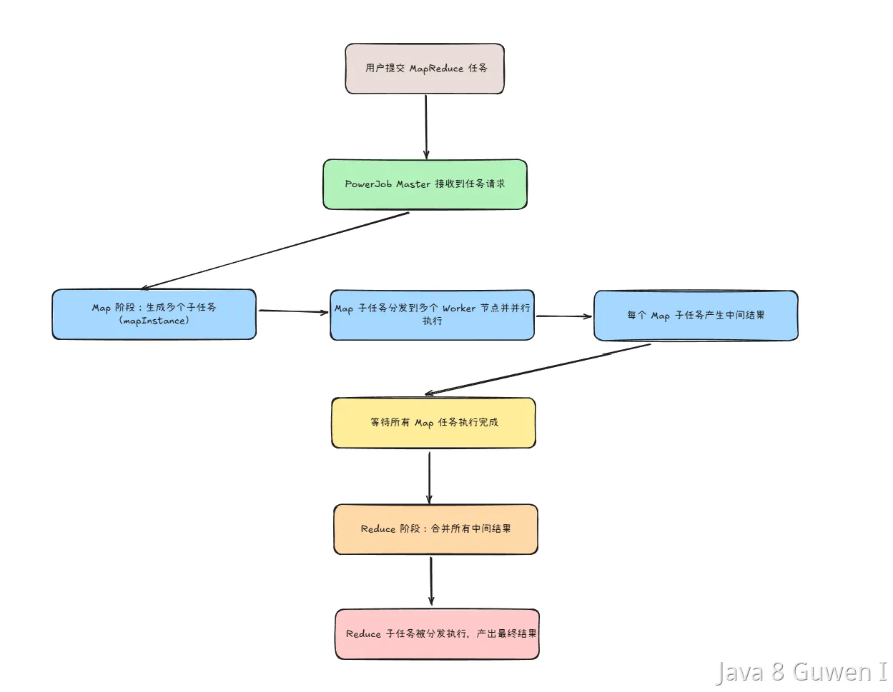

在PowerJob和Schedulerx中都支持MapReduce动态分片。它其实是借鉴了 Hadoop 的 MapReduce 思想 —— **将任务拆分成多个子任务（Map 阶段），并最终将子任务的结果聚合处理（Reduce 阶段）**，支持数据驱动的分布式计算。    

他的主要流程如下： 

 

**相比于xxl-job的静态分片任务，他不需要事先设定好分片数，而是根据你输入的数据动态生成子任务，然后再把这些子任务均分给你的具体的执行的实例。这样一来，他就能更好的扩展性，只要你新加了机器，就可以立刻被利用上，而不需要调整分片数。而且不需要把分片数和节点数绑定，不会导致资源的浪费或者不足。** 

想要在PowerJob中使用mapReduce任务，要继承 MapReduceProcessor 类，实现 map 和 reduce 方法： 

然后控制台上任务类型选择MapReduce就行了。不需要自己手动配置分片数。 