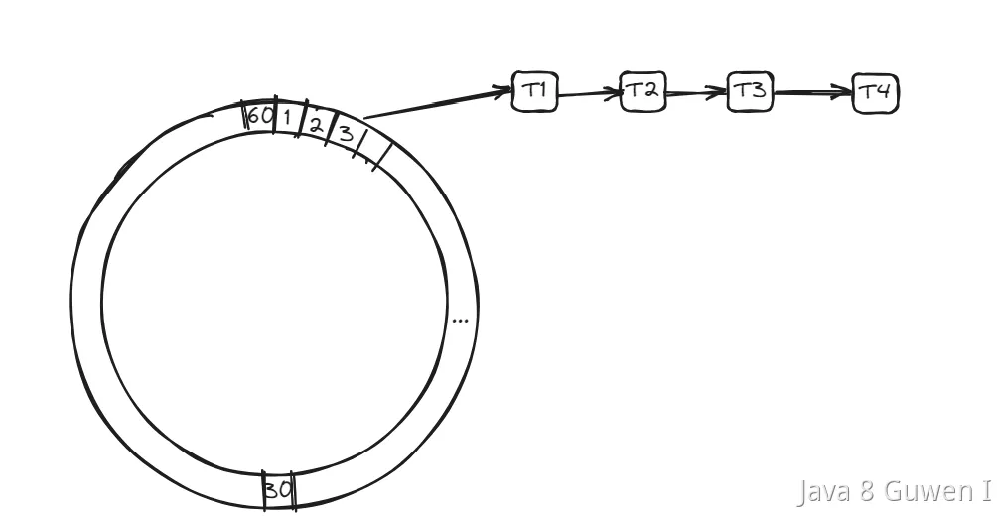
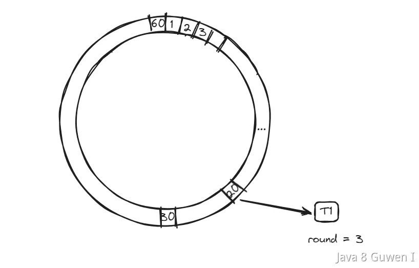
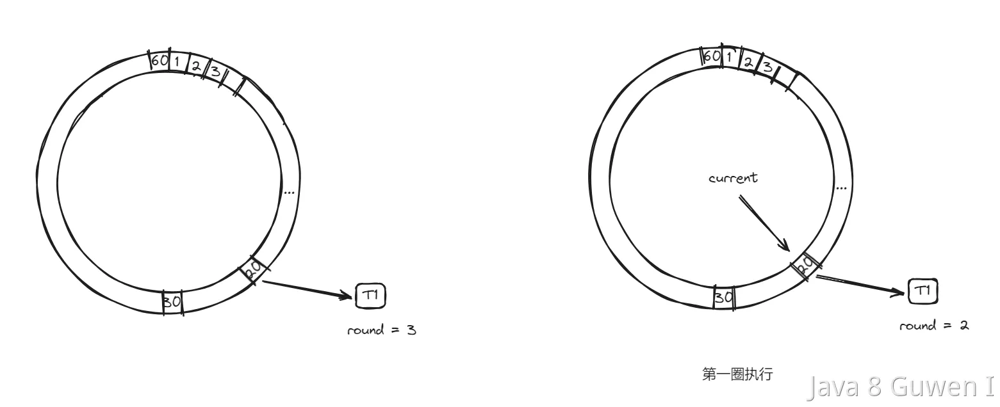
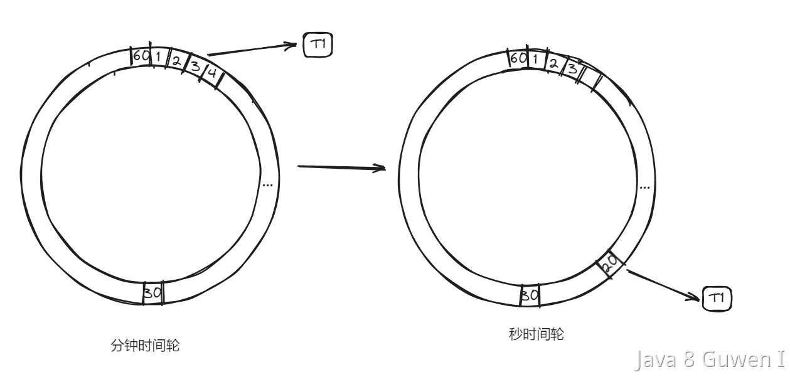

时间轮算法（Time Wheel Algorithm）是一种用于处理**定时任务和调度**的常见算法。  

时间轮算法主要需要定义一个时间轮盘，在一个时间轮盘中划分出多个槽位，每个槽位表示一个时间段，这个段可以是秒级、分钟级、小时级等等。如以下就是把一个时间轮分为了60个时间槽，每一个槽代表一秒钟。 

然后当我们有定时任务需要执行的时候，就把他们挂在到这些槽位中，这个任务将要在哪个槽位中执行，就把他挂在到哪个槽位的链表上。  比如当前如果是0秒，那么要3秒后执行，那就挂在槽位为3的那个位置上。 

 

而随着时间的推移，轮盘不断旋转，任务会被定期触发。  

因为这个时间轮是60个槽位，那么他就会在一分钟完整的转完一圈，那么就有一个指针，每一秒钟在槽位中进行一次移动。这个操作是有一个单独的线程来做的，他的工作就是每一秒钟改变一次current指针。 

然后还有一个线程池，在指针轮转到某个槽位上的时候，在线程池中执行链表中需要执行的任务。  

以上就是一个简单的时间轮算法，**但是这个时间轮存在一个问题，那就是我们把它分了60个槽，那么就意味着我们的定时任务最多只支持60s以内的。**  

**那么，怎么解决这个问题呢？**  

首先能想到的最简单的方式就是加槽位，比如我要支持5分钟的延迟任务，那么就可以把槽位设置为300个。  

还有就是也可以调整时间轮槽位移动的延迟，比如把1秒钟移动一次，改为1分钟移动一次，那么就可以支撑60分钟的延迟任务了。  

但是这两个办法都不够灵活，而且是有瓶颈的。于是有一种新的办法。 

### round 

在时间轮中**增加一个round的标识，标识运行的圈数**，比如说上面的60s的时间轮，如果我要200s之后运行，那么我在设置这个任务的时候，就把他的round设置为 200/60 = 3 ，然后再把它放到 200%60 = 20的这个槽位上。 

 

有了这个round之后，每一次current移动到某个槽位时，**检查任务的round是不是为0，如果不为0，则减一。** 

 

这样时间轮转到第三圈时，round的值会变成0，再第四圈运行到current=20的时候，发现round=0了，那么就可以执行这个任务了。  这样就解决了我们前面说的问题了。  但是这个方案还存在一个问题，那就是这个round的检查过程，需要把所有任务都遍历一遍，效率还是没那么高。 

### 分层时间轮 

为了解决遍历所有任务的问题，我们可以引入分层时间轮。我们在刚刚的秒级时间轮的基础上，在定义一个分钟级时间轮 

 

也就是说我们对于200s以后执行这个任务，我们先把他放到分钟级时间轮上，这个时间轮的槽位每一分钟移动一次，当移动时候，发现某个槽位上有这一分钟内需要执行的任务时。  把这个任务取出来，放到秒级时间轮中。这样在第3分20秒的时候，就可以运行这个任务了。  

这就是分层时间轮。在分层时间轮包括多个级别的时间轮，每个级别的时间轮都有不同的粒度和周期。  

通常，粒度较细的时间轮拥有更短的周期，而粒度较粗的时间轮拥有更长的周期。例如，分层时间轮可以包括毫秒级、秒级、分钟级等不同粒度的时间轮。  

当一个任务需要被调度时，它被分配到适当级别的时间轮中，每个级别的时间轮都独立地旋转。当一个时间轮的指针到达某个位置时，它将触发执行该级别时间轮中的任务。如果某个任务在较粗的时间轮中已经到期，它将被升级到下一级时间轮。  

当任务升级到下一级时间轮时，任务的调度粒度变得更细。这意味着任务将在更短的时间内被触发，从而更精确地满足其调度要求。 

时间轮的应用：

1. Netty：Netty 是一款高性能的网络通信框架，它使用时间轮算法来处理定时任务和超时检测。时间轮用于管理通道的超时和重连机制。 
2. Kafka：Apache Kafka 是一个分布式消息队列系统，它使用时间轮算法来管理消息的过期和删除。时间轮用于清理过期消息，以释放存储空间。 
3.  xxl-job：在以前的版本的xxl-job中，使用quartz做定时任务调度，但是在7.28版本中去除了quartz，改用了时间轮算法。 

