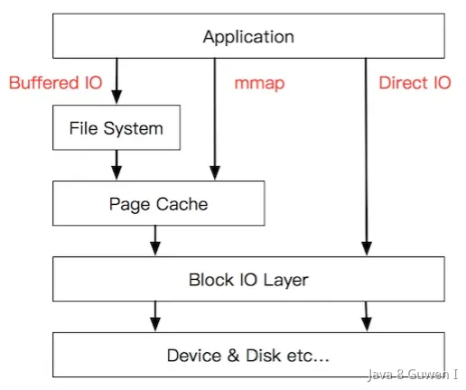
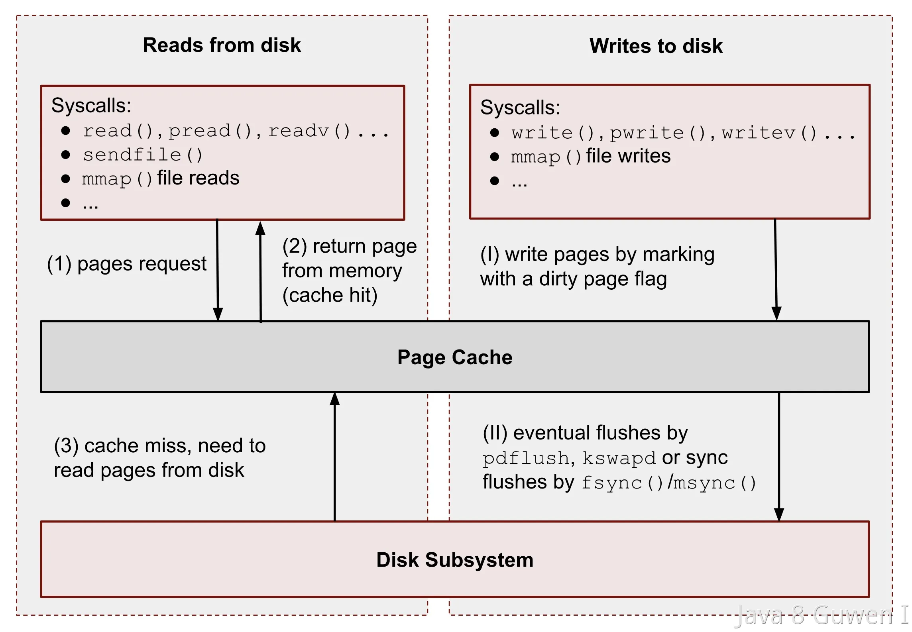

在操作系统中，文件数据是存储在磁盘上的，而每次应用程序想要读取数据的时候，如果都和磁盘进行交互，速度会非常慢，不仅是读请求会慢，写操作也是一样的，向磁盘中直接写入数据也需要很大的时延。 

**为了提升磁盘的读写效率，操作系统在磁盘之上，通过了一个page cache（页缓存），页缓存其实是内存的一种，他就是可以将数据缓存到内存中，从而减少对磁盘的实际读写操作。**   

 

通过在内存中缓存数据，操作系统可以更快速地响应文件操作请求，因为访问内存的速度比访问磁盘快得多。 

> 页缓存中的“页”（page）是指计算机内存管理中的基本单位。在大多数操作系统中，内存被分成固定大小的块，这些块通常称为“页”。页的大小通常是2的幂，例如4 KB或8 KB。 

### 读写过程 

 

有了page cache之后，一次**读操作**的过程如下： 

- 当一个应用程序请求读取文件时，操作系统首先检查page cache是否已经包含了所需的数据。 
- 如果数据在cache中（称为“命中”），则直接从内存中读取数据，避免了磁盘I/O操作。 
- 如果数据不在cache中（称为“未命中”），则从磁盘读取数据，并将数据写入page cache，以便下次读取时能够更快地获取数据。 

**这里面读取到数据大小并不是用多少取多少，而是采用预读的方式，额外读取一些数据，预读的大小一般都是以页为单位的。如果请求读取的数据量小于一页（通常4k），操作系统通常仍会读取完整的一页。** 

如果应用程序请求的数据量大于一页，操作系统可能会一次性读取多个连续的页，以减少后续的磁盘I/O操作。 

有了page cache之后，一次写操作的过程如下： 

当向文件中**写入数据**时，然后从文件中读取数据到页缓存，并且把新数据写入到页缓存中。对于被修改的页缓存，内核会定时把这些页缓存刷新到文件中。 

- 当一个应用程序请求写入文件时，如果要写入的数据所在的页缓存已经存在，那么直接把新数据写入到页缓存即可，否则，内核首先会申请一个空闲的内存页（页缓存）。 
- 操作系统通常将数据写入page cache中，而不是立即写入磁盘。这种方法被称为“延迟写”或“写回缓存”（write-back caching）。 
- 页缓存中的数据会标记为“脏页”（dirty pages），表示这些数据需要写入磁盘 
- 操作系统不会立即将脏页写入磁盘，而是会等待合适的时机（如系统空闲时或达到一定阈值时）将脏页批量写入磁盘。这种方式可以减少磁盘写操作的频率，提高整体系统性能。   

脏页写入磁盘的触发条件一般有以下几个： 

- **页缓存的大小达到一定阈值时，操作系统会触发写入操作，将部分或全部脏页写入磁盘。** 
- **系统内存压力增大时，操作系统也可能会主动将脏页写入磁盘，以释放内存空间。** 
- **文件系统的同步操作（如fsync、sync命令）会强制将所有脏页写入磁盘，以确保数据持久化。** 