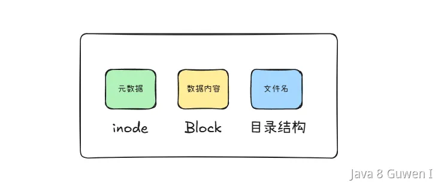
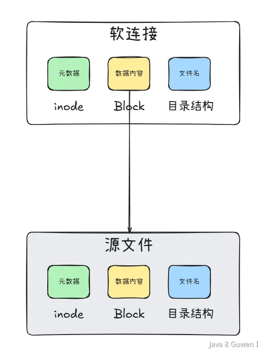
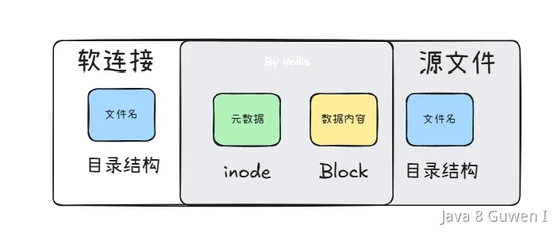
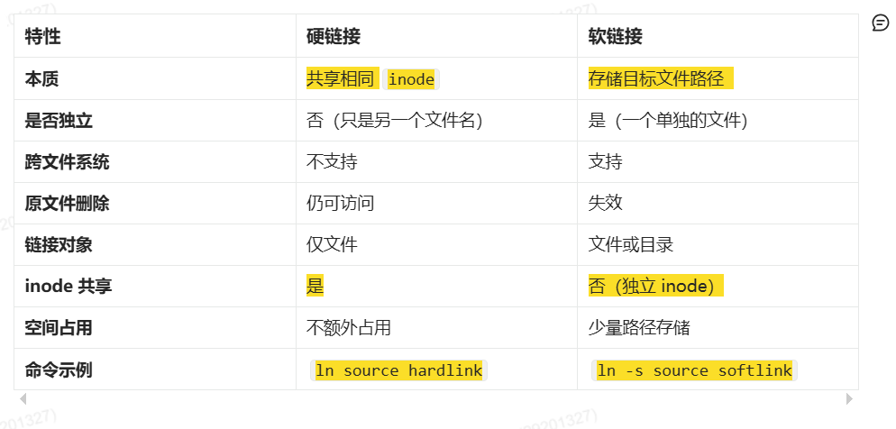

在 Linux 文件系统中，一个文件由多个部分组成，主要可以分为以下几部分： 

-  **数据内容（Data Blocks）** 
-  **元数据（Metadata，存储在 inode 中）** 
- **文件名（存储在目录结构中）** 
- 权限信息 
- 时间信息 
- 扩展属性（Extended Attributes） 

以上，比较关键的就是**数据内容、元数据和文件名**三部分。 

 

### inode 

上面提到一个重要的属性——inode，在 Linux/Unix 文件系统中，文件是通过` inode` 进行管理的。**当你创建一个文件时，系统会为它分配一个 inode，这个 inode 记录了文件的各种信息（但不包括文件名）**。  所以，我们可以认为`inode`（索引节点）是文件的“身份信息”，用于存储文件的元数据。每个文件都有一个唯一的 `inode` 号，它指向文件存储的数据块。   

每个 inode 主要存储以下信息： 

-  文件类型（普通文件、目录、符号链接等） 
- 权限（如 rwxr-xr-x） 
- 文件所有者（UID） 
- 文件所属组（GID） 
- 文件大小 
- 创建时间（ctime）、修改时间（mtime）、访问时间（atime） 
- 文件的**硬链接数** 
- 文件数据所在的磁盘块指针 
-  inode 号（唯一标识该文件） 

**注意：inode 不存储文件名**，文件名存储在目录结构中，而目录本质上是文件名到 inode 号的映射。 

在 Linux 中，可以使用 `ls -i` 命令查看文件的 inode 号：   

### 软链接和硬链接 

Linux 链接分两种，一种被称为**硬链接（Hard Link）**，另一种被称为**符号链接（Symbolic Link）**。默认情况下，ln 命令产生硬链接。 

```bash
# 创建硬链接
ln original.txt hardlink.txt

# 创建软链接
ln -s original.txt softlink.txt
```


**软连接可以理解为 Windows 中的“快捷方式”，它本身是一个特殊的文件，存储的内容是目标文件的路径。当我们访问软连接时，系统会自动跳转到目标文件。** 

 

**硬链接可以理解为“同一个文件的不同名称”。它与原文件共享相同的 inode 号（扩展知识有介绍），因此它们实际上是同一个文件，数据存储在同一位置。**   

 

所以，**硬链接与原文件共享同一个 inode 和数据块。不额外占用存储空间，只是增加一个目录结构而已。而软链接拥有自己的 inode，存储的数据内容为目标文件的路径字符串**，另外还有以下差别： 

- 软连接可以跨文件系统（不同的磁盘分区）。 硬链接必须在同一个文件系统（不能跨分区）。   
- 软连接可以指向目录或文件。 硬链接只能指向文件，不能指向目录（为防止循环引用）。 
- 软连接依赖于原文件，如果原文件被删除，软连接会失效（“断链”）。硬链接删除原文件后，其他硬链接仍可访问数据，直到所有硬链接均被删除（inode 引用计数归零）。 
- 硬链接的权限、时间戳、所有者等信息与原文件完全一致。软连接拥有自己的权限、时间戳（但访问时继承目标权限）。 

